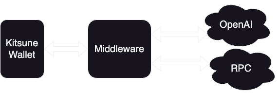

# Kitsune


Your AI powered crypto wallet.

## Use Case

Currently, UX is one of the biggest problems that crypto faces. The average user is not able to understand the complex concepts of crypto, and the current solutions are not user friendly.

Kitsune aims to solve this problem by using OpenAI's GPT-3 to convert natural language into JSON objects that can be used to interact with your wallet.

## Architecture



Kitsune forwards your requests to a local middleware, which uses OpenAI's GPT model to convert your request into a JSON object. This object is then validated and sent to your wallet for confirmation.

After confirming the transaction, the transaction is then sent to your RPC, completing the transaction.

## Usage

### Prerequisites

- [OpenAI API Key](https://beta.openai.com/)
- [Node.js](https://nodejs.org/en/)

### Installation

1. Clone the repository

```bash
git clone https://github.com/altugbakan/kitsune.git
```

2. Install dependencies

```bash
npm install
```

3. Create a `.env` file in the root directory and add the following variables

```bash
OPENAI_API_KEY=<YOUR_API_KEY>
RPC_URL=<YOUR_RPC_URL>
PRIVATE_KEY=<YOUR_PRIVATE_KEY>
```

4. Start the server

```bash
npm start
```

5. Install the Kitsune Chrome Extension

- Go to `chrome://extensions/`
- Enable developer mode
- Click `Load unpacked`
- Select the [extension](./extension/) folder

## License

[MIT](./LICENSE)

## Acknowledgements

Images used in this project are from [FreePik](https://www.freepik.com/).
